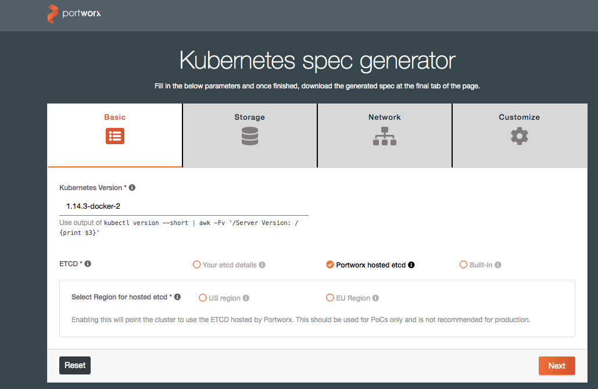
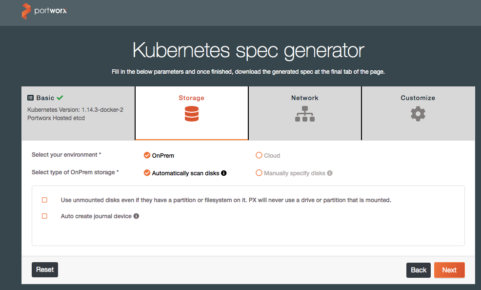
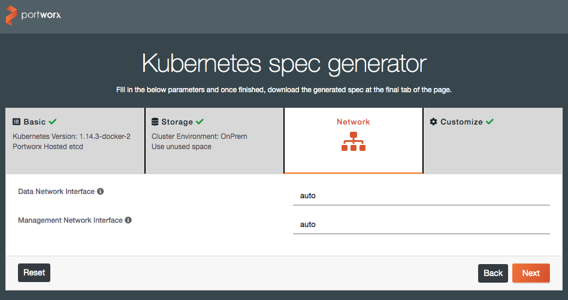
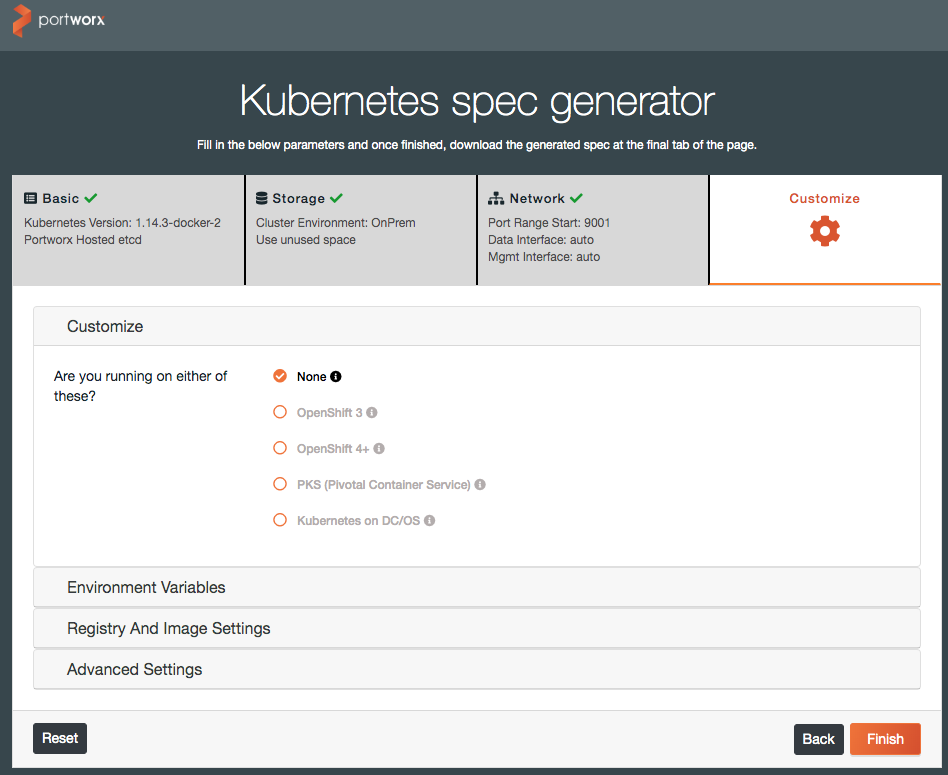
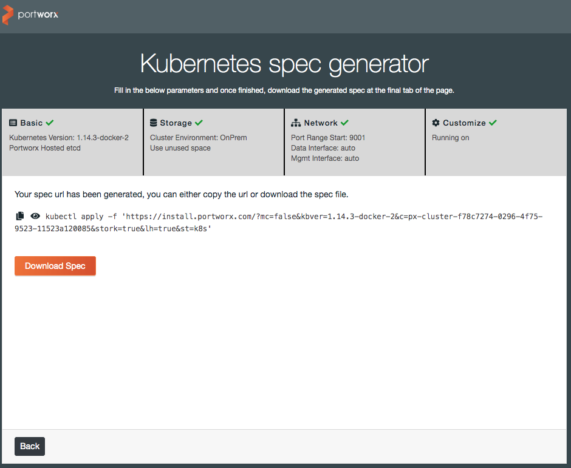

## Overview

Portworx is one of the leading Software-Defined Storage solutions for container deployments. This document is a walkthrough of installing Portworx on a Docker Enterprise 3.0 install for Kubernetes workloads.

## Prerequisites

The following prerequisites are required to successfully complete this guide:


- Docker Enterprise 3.0 installed with at least two Kubernetes worker nodes
- A license for, or trial of Portworx Enterprise
- A workstation with the kubectl command bound to your Docker Enterprise install. (This can be the installation's master node)

## Installation and Configuration

1. First step:
    Add an unmounted disk of 50Gb min to each worker node. You should be able to see the unmounted disk with the following command once you log in to each worker node

    ```
    NAME    MAJ:MIN RM  SIZE RO TYPE MOUNTPOINT
    loop0     7:0    0 88.5M  1 loop /snap/core/7270
    loop1     7:1    0   18M  1 loop /snap/amazon-ssm-agent/1455
    loop2     7:2    0 10.1M  1 loop /snap/kubectl/1139
    loop3     7:3    0 88.7M  1 loop /snap/core/7396
    xvda    202:0    0   20G  0 disk
    └─xvda1 202:1    0   20G  0 part /
    xvdb    202:16   0  100G  0 disk /var/lib/docker
    xvdf    202:80   0  150G  0 disk

    ```

2. Second step:
    Confirm the Docker Enterprise version with the following command on your prepared workstation.

    ```
    $ kubectl version --short | awk -Fv '/Server Version: / {print $3}'
    1.14.3-docker-2
    ```

3. Third step:

    In this step, we will use Portworx's online install wizard to create a Kubernetes YAML deployment definition.

    In a web browser, navigate to http://install.portworx.com and enter the Docker version and select "Portworx hosted etcd" under the ETCD section, and click "Next."

    

    On the next page, select "OnPrem" and leave everything else default. Click "Next."

    

    On the third page, leave everything default. Click "Next."

    

    On the Customize page, select "None" in the Customize section. Click "Finish."

    

    On the last screen, you can either copy the example command to run from your workstation, or download the YAML spec file for inspection and alterations.

    

    Note: if you use the spec file, open it up in a text editor and replace the `{UUID}` value with a new UUID. You can generate one at a linux command prompt via:

    ```
    $ uuid
    056d3c88-c3b0-11e9-9d56-ef363149603d
    ```

    Then apply the spec file in the usual way with the kubectl command:

    ```
    $ kubectl apply -f spec.yaml
    ```


## Monitoring and Troubleshooting

Portworx maintains documentation at <https://docs.portworx.com>.

They have sections with advice for monitoring and production use, as well as troubleshooting your installation.

Included here are a few commands that are useful in diagnosing installation issues:

Describe PX pods:

```
kubectl describe pods -l name=portworx -n kube-system
```

Get PX cluster status:

```
PX_POD=$(kubectl get pods -l name=portworx -n kube-system -o jsonpath='{.items[0].metadata.name}')
kubectl exec $PX_POD -n kube-system -- /opt/pwx/bin/pxctl status
```

Recent Portworx logs can be gathered by using this kubectl command:

```
kubectl logs -n kube-system -l name=portworx --tail=99999
```

If you have access to a particular node, you can use this journalctl command to get all Portworx logs:

```
journalctl -lu portworx*
```

## Further Reading

Refer to the following links for additional information:

- <https://docs.portworx.com>
- <https://docs.portworx.com/cloud-references/deployment-arch/>
- <https://docs.portworx.com/reference/knowledge-base/>
